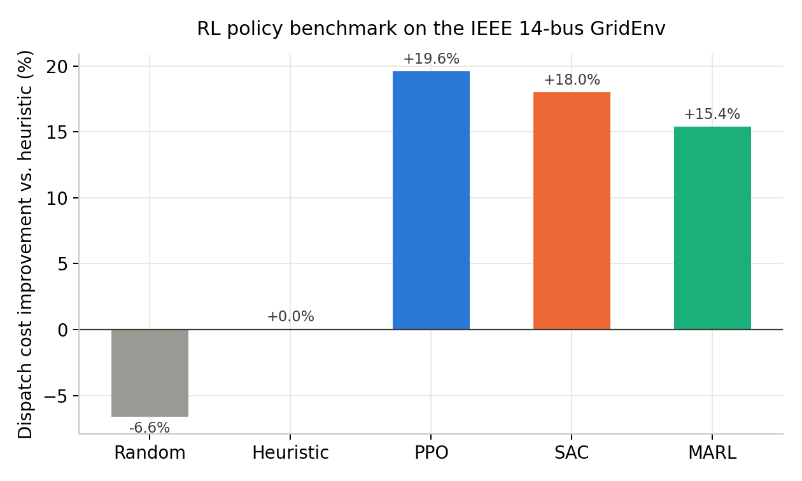
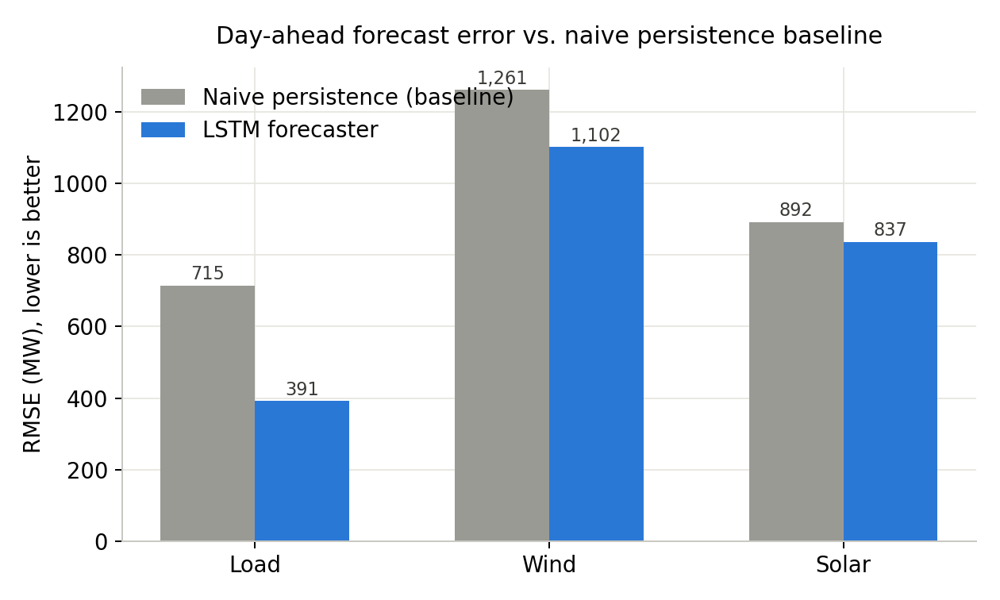
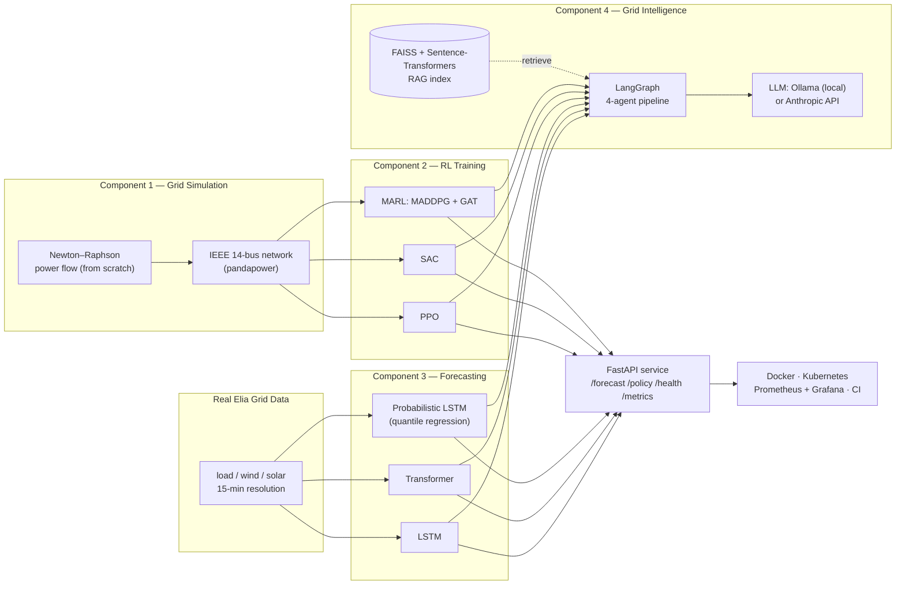
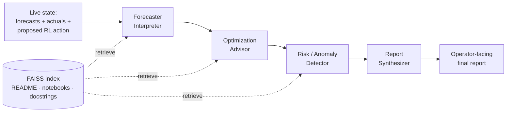
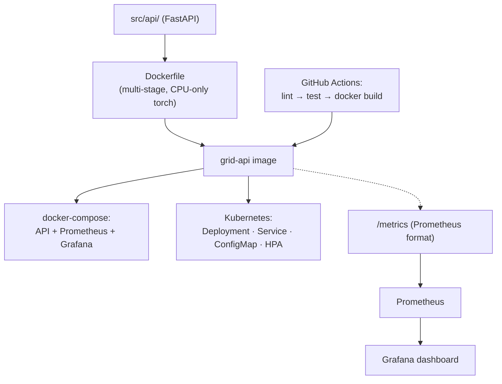

# Smart Grid Energy Optimization

A deep reinforcement learning, probabilistic forecasting, and LLM-agent system for
optimizing energy dispatch on an electrical grid. It combines a from-scratch
physics-informed power flow simulator, multi-algorithm RL for battery/generation
dispatch, deep learning forecasters trained on real Belgian transmission-grid data, and
an LLM-orchestrated multi-agent pipeline that turns model outputs into operator-facing
recommendations — all served through a production-shaped deployment layer (API,
containers, orchestration, monitoring, CI).

<p align="center">
  
  
</p>

## Contents

- [Architecture](#architecture)
- [Component 1 — Physics-Informed Grid Simulation](#component-1--physics-informed-grid-simulation)
- [Component 2 — Multi-Algorithm Reinforcement Learning](#component-2--multi-algorithm-reinforcement-learning)
- [Component 3 — Deep Learning Forecasting](#component-3--deep-learning-forecasting)
- [Component 4 — LLM-Powered Grid Intelligence Agents](#component-4--llm-powered-grid-intelligence-agents)
- [Deployment Infrastructure](#deployment-infrastructure)
- [Project Structure](#project-structure)
- [Getting Started](#getting-started)
- [Testing](#testing)
- [Tech Stack](#tech-stack)
- [Data Source](#data-source)
- [Known Limitations](#known-limitations)

## Architecture



Four largely independent components share one real dataset and converge in a single
served API: a hand-derived power flow simulator provides the training environment for
reinforcement learning, deep learning forecasters predict the grid quantities RL and the
LLM agents both consume, and the LLM pipeline narrates the other three components'
outputs for a human operator rather than replacing them.

## Component 1 — Physics-Informed Grid Simulation

`src/physics/power_equations.py` implements AC power flow **from scratch** — not a call
into an existing solver — and is verified against `pandapower`'s IEEE 14-bus benchmark
network topology (`src/environment/grid_env.py`).

A grid is a network of buses connected by transmission lines, each with admittance
$Y_{kj} = G_{kj} + jB_{kj}$. Writing every bus voltage in polar form
$V_k = |V_k|e^{j\delta_k}$ and separating the complex power balance
$S_k = V_k \cdot \overline{I_k}$ into real and imaginary parts gives the two nonlinear
power flow equations solved at every bus:

$$P_k = |V_k|\sum_j |V_j|\big(G_{kj}\cos(\delta_k-\delta_j) + B_{kj}\sin(\delta_k-\delta_j)\big)$$

$$Q_k = |V_k|\sum_j |V_j|\big(G_{kj}\sin(\delta_k-\delta_j) - B_{kj}\cos(\delta_k-\delta_j)\big)$$

These have no closed-form solution, so `power_equations.py` solves them with
**Newton-Raphson**: linearize around the current estimate using the Jacobian of
$(P, Q)$ with respect to $(\delta, |V|)$, solve for the update, repeat until the mismatch
converges. `notebooks/power_flow_math.ipynb` derives the full Jacobian and confirms
convergence on both a small hand-built system and the real 14-bus network.

`src/environment/grid_env.py` wraps this solver in a `gymnasium.Env` (`GridEnv`): 4
controllable generator buses, a battery, wind and solar injection, and a
demand-response price signal, all driven through the same physically-grounded power
flow every step — this is what Component 2 trains against.

## Component 2 — Multi-Algorithm Reinforcement Learning

Three genuinely different RL approaches are trained and benchmarked against each other
and against two non-learned baselines on `GridEnv`, using identical evaluation seeds for
a fair comparison (`src/training/benchmark.py`):

| Policy | Approach | Dispatch cost vs. heuristic |
|---|---|---:|
| Random | Uniform random actions | −6.6% (worse) |
| Heuristic | Rule-based dispatch | baseline (0.0%) |
| **PPO** | Proximal Policy Optimization (Stable-Baselines3) | **+19.6%** |
| **SAC** | Soft Actor-Critic, max-entropy (Stable-Baselines3) | **+18.0%** |
| **MARL** | Multi-agent MADDPG with graph attention | **+15.4%** |


All three learned policies clear the heuristic baseline by a wide margin; PPO edges out
the others here, and MARL's decentralized, per-generator-agent structure trades a little
raw performance for a design that scales more naturally to a larger, more realistic bus
count than a single centralized policy would.

**PPO and SAC** both learn a policy $\pi_\theta$ that maximizes expected discounted
return, $J(\theta) = \mathbb{E}_\pi\!\left[\sum_t \gamma^t r_t\right]$. PPO bounds each
policy update with a clipped surrogate objective so a single update step can't move the
policy too far from the data it was collected under:

$$L^{\text{CLIP}}(\theta) = \mathbb{E}_t\left[\min\big(r_t(\theta)\,\hat{A}_t,\ \text{clip}(r_t(\theta),\,1-\epsilon,\,1+\epsilon)\,\hat{A}_t\big)\right]$$

SAC instead maximizes return **plus** policy entropy $\mathcal{H}(\pi(\cdot\mid s))$,
trading a small amount of return for a policy that keeps exploring rather than
collapsing onto one action early.

**MARL** treats each of the 4 generator buses as its own agent (MADDPG:
centralized critic during training, decentralized actors at execution) whose actor
network is a **Graph Attention Network** (`torch_geometric.nn.GATConv`) over the grid's
own bus topology, so each agent's action is informed by its electrical neighbors, not
just its own local state:

$$e_{ij} = \text{LeakyReLU}\big(a^\top [W h_i \,\|\, W h_j]\big), \qquad
\alpha_{ij} = \frac{\exp(e_{ij})}{\sum_{k \in \mathcal{N}(i)} \exp(e_{ik})}, \qquad
h_i' = \sigma\!\Big(\sum_{j \in \mathcal{N}(i)} \alpha_{ij}\, W h_j\Big)$$

`notebooks/rl_theory.ipynb` derives PPO's clipped objective, SAC's entropy-regularized
formulation, and the GAT attention mechanism above from first principles.

## Component 3 — Deep Learning Forecasting

Three forecasters, trained on real 15-minute Belgian grid data from the Elia Open Data
Portal, all solving the same task for a fair comparison: given a 24-hour history window,
predict the same quantity 24 hours ahead (a genuine day-ahead forecast). Every model
generalizes across all three grid quantities via `--target {load_mw,wind_mw,solar_mw}`.

| Target | Naive persistence RMSE | LSTM RMSE | Improvement |
|---|---:|---:|---:|
| Load | 715.0 MW | **391.4 MW** | 45.3% |
| Wind | 1,261.2 MW | **1,101.7 MW** | 12.6% |
| Solar | 891.7 MW | **836.9 MW** | 6.1% |


Wind and solar show smaller gains than load — expected, since neither model receives any
weather input, and both are genuinely more stochastic processes than a demand series
with a strong, learnable daily cycle (quantified directly in
`notebooks/stochastic_renewable.ipynb`). Solar predictions are clipped to ≥ 0 MW post
hoc (12,314 negative predictions clipped in the real evaluation run) since a generation
quantity can never be physically negative.

**Benchmarked against a real grid operator's own forecast.** `src/forecasting/evaluate_vs_elia.py`
runs a fair, apples-to-apples comparison of the LSTM against Elia's own published
"Day-ahead 6PM forecast" — a genuine operational forecast published the day before
delivery, evaluated on the exact same aligned timestamps, val split only. Using only its
own load history and calendar features (no weather, no planned-outage data — inputs a
real transmission operator has and this project doesn't), the LSTM lands within roughly
16% RMSE of Elia's professional forecasting system — reported as the honest gap it is,
not rounded up, and a genuinely strong result for a from-scratch model with a much
narrower feature set.

**LSTM** (`src/forecasting/lstm_model.py`) carries information across the 96-step window
through a cell state gated at every step:

$$f_t = \sigma(W_f[h_{t-1},x_t]+b_f),\quad i_t = \sigma(W_i[h_{t-1},x_t]+b_i),\quad
\tilde{c}_t = \tanh(W_c[h_{t-1},x_t]+b_c)$$

$$c_t = f_t \odot c_{t-1} + i_t \odot \tilde{c}_t, \qquad
o_t = \sigma(W_o[h_{t-1},x_t]+b_o), \qquad h_t = o_t \odot \tanh(c_t)$$

**Transformer** (`src/forecasting/transformer_model.py`) instead attends over the whole
window at once — every position reaches every other position in a single step, rather
than being relayed through 96 sequential updates:

$$\text{Attention}(Q,K,V) = \text{softmax}\!\left(\frac{QK^\top}{\sqrt{d_k}}\right)V$$

It scored **~4% higher RMSE than the LSTM on this task** (407.0 MW vs. 391.4 MW on load)
— a legitimate, reported result on a comparatively short, strongly seasonal series,
not a bug: attention's main advantage (cheap long-range dependencies) matters less when
an LSTM's forget gate already handles a 96-step window comfortably.

**Probabilistic LSTM** (`src/forecasting/probabilistic.py`) trades a single point
estimate for three quantiles (10th/50th/90th percentile), trained with the pinball loss:

$$L_\tau(y,\hat y) = \begin{cases} \tau(y-\hat y) & y \ge \hat y \\ (1-\tau)(\hat y - y) & y < \hat y \end{cases}$$

On the real load evaluation: **0% quantile crossing** (0 / 31,675 predictions), median
MAE of 279.5 MW, and 74.4% empirical coverage of the [q10, q90] interval against an 80%
target — an honestly under-calibrated but directionally correct uncertainty band,
reported as such rather than rounded up.

Notebooks make all of this reproducible and inspectable rather than just asserted:
`notebooks/forecasting_theory.ipynb` (full derivations + live re-execution against real
checkpoints), `notebooks/stochastic_renewable.ipynb` (wind/solar stochasticity
quantified, calibration extended to all three targets, a residual-bootstrap scenario
generator), and `notebooks/eda_grid_data.ipynb` (the underlying data itself).

## Component 4 — LLM-Powered Grid Intelligence Agents

A four-agent pipeline, orchestrated with **LangGraph**, turns the other three
components' raw outputs into one operator-facing report — grounded in this project's
own real, verified results via retrieval-augmented generation, not the LLM's own
possibly-stale recollection of them.



- **RAG**: project docs, notebooks, and docstrings chunked (800 chars, 100 overlap),
  embedded with `sentence-transformers` (`all-MiniLM-L6-v2`), indexed with **FAISS**
  (`IndexFlatIP` over normalized embeddings — cosine similarity).
- **Forecaster Interpreter**: explains what the forecasts say and how actuals compare —
  explicitly instructed never to claim a match against a forecast that wasn't available,
  after an early real run showed a local model hallucinating exactly that.
- **Optimization Advisor**: explains the proposed dispatch action from a genuine
  inference call against a trained PPO/SAC/MARL checkpoint (`policy_inference.py`),
  citing this project's own real benchmark numbers rather than asserting confidence.
- **Risk/Anomaly Detector**: a deterministic >15% actual-vs-forecast deviation check
  runs *before* the LLM call, so an anomaly flag is never solely the model's own
  judgment call.
- **Report Synthesizer**: combines the three prior outputs into one report under 200
  words, instructed not to introduce any claim the earlier agents didn't already make.
- **LLM backend**: pluggable behind one `.complete(system, user)` interface —
  **Ollama** (local, free, `llama3.1:8b` by default) or the **Anthropic API** (Claude),
  selected via `LLM_BACKEND`.

## Deployment Infrastructure



| Endpoint | Returns |
|---|---|
| `GET /health` | Liveness check |
| `GET /forecast/{target}` (`model=lstm` or `transformer`) | Point forecast from a real checkpoint |
| `GET /forecast/{target}/quantiles` | q10/q50/q90 from the probabilistic model |
| `GET /policy/{policy_name}` (`PPO`, `SAC`, or `MARL`) | A real decoded RL action from live inference |
| `GET /metrics` | Prometheus-format request/latency metrics |

Every response is a genuine inference call against a real checkpoint — none are mocked
or hardcoded — and every endpoint returns a clear, specific error (naming the exact
training command) when the checkpoint it needs hasn't been trained yet.

## Project Structure

```
smart-grid-rl/
├── src/
│   ├── physics/              # Component 1: from-scratch Newton–Raphson power flow
│   ├── environment/          # GridEnv (gymnasium.Env) + renewable/battery/demand models
│   ├── agents/                # PPO/SAC wrappers, MADDPG + GAT actor-critic
│   ├── training/               # Training loops + the PPO/SAC/MARL benchmark
│   ├── forecasting/             # LSTM, Transformer, probabilistic-LSTM forecasters,
│   │                            # + evaluate_vs_elia.py (real operator-forecast comparison)
│   ├── grid_intelligence/       # RAG, LangGraph pipeline, LLM clients, policy inference
│   └── api/                    # FastAPI service
├── notebooks/                   # Theory + live, re-executable result notebooks
│   ├── power_flow_math.ipynb    # Newton–Raphson Jacobian derivation
│   ├── rl_theory.ipynb          # PPO/SAC/GAT-attention derivations
│   ├── forecasting_theory.ipynb
│   ├── stochastic_renewable.ipynb
│   └── eda_grid_data.ipynb
├── tests/                        # pytest suite (pure-math + API smoke tests)
├── k8s/                            # Kubernetes manifests
├── monitoring/                     # Prometheus + Grafana config
├── docs/images/                     # README figures
├── Dockerfile, docker-compose.yml
└── .github/workflows/ci.yml
```

## Getting Started

```bash
python -m venv venv && venv\Scripts\activate      # Windows
pip install -r requirements-api.txt

# Component 1 + 2: train and benchmark RL policies
python src/training/benchmark.py

# Component 3: train a forecaster (repeat per --target)
python src/forecasting/lstm_model.py --target load_mw

# Compare against Elia's own real day-ahead forecast (load only)
python src/forecasting/evaluate_vs_elia.py

# Component 4: build the RAG index once, then run the agent pipeline
python src/grid_intelligence/build_rag_index.py
python src/grid_intelligence/run_pipeline.py

# Serve the API
uvicorn main:app --app-dir src/api --reload --port 8000   # http://localhost:8000/docs

# Full local stack: API + Prometheus + Grafana
docker compose up --build
```

## Testing

```bash
pip install -r requirements-dev.txt
pytest tests/ -v      # pinball loss, quantile clipping, RL action decoding, API smoke tests
ruff check src/api/ tests/
```

`.github/workflows/ci.yml` runs the same lint-and-test job on every push, then a
build-only Docker step to confirm the deployable image keeps building.

## Tech Stack

| Category | Tools |
|---|---|
| Language | Python 3.11+ (developed on 3.13) |
| Numerical / Data | NumPy, pandas |
| Deep Learning | PyTorch |
| Graph Neural Networks | PyTorch Geometric (`GATConv`) |
| Reinforcement Learning | Gymnasium, Stable-Baselines3 (PPO, SAC), custom MADDPG |
| Power Systems Simulation | pandapower, a from-scratch Newton–Raphson solver |
| LLM Orchestration | LangGraph |
| Embeddings & Vector Search | Sentence-Transformers (`all-MiniLM-L6-v2`), FAISS |
| LLM Backends | Ollama (local), Anthropic API (Claude) |
| API | FastAPI, Uvicorn, Pydantic |
| Monitoring | Prometheus, Grafana, `prometheus-fastapi-instrumentator` |
| Containers & Orchestration | Docker (multi-stage builds), Docker Compose, Kubernetes |
| CI/CD | GitHub Actions |
| Testing & Linting | pytest, ruff |
| Notebooks & Visualization | Jupyter, `nbformat`, Matplotlib |
| Training Hardware | NVIDIA RTX 4060 Laptop GPU (CUDA) |

## Data Source

Real 15-minute-resolution Belgian transmission grid data from the
[Elia Open Data Portal](https://opendata.elia.be/): total load (with Elia's own
day-ahead forecast, used as the real baseline Component 3 is compared against), wind
generation, and solar generation. `src/forecasting/data_loader.py` documents and handles
two real data-quality issues found in the raw files: small negative wind readings from
DST/upscaling noise (clipped to 0), and solar's 3-level regional reporting hierarchy
(filtered to avoid double-counting when summing to a national total).

## Known Limitations

Stated directly rather than glossed over:

- Forecasters use no weather-forecast or calendar/holiday input — a natural next step
  for closing more of the gap on wind and solar specifically (and the remaining ~16% gap
  to Elia's own operational forecast).
- The probabilistic forecaster's [q10, q90] interval is under-calibrated (74.4% vs. an
  80% target on load).
- `GridEnv` is a synthetic IEEE 14-bus test system — real, physically grounded, but
  disconnected in scale from the real Belgian grid data Components 3 and 4 use; an RL
  policy's proposed action is a genuine inference result on its own training
  environment, not a projection onto real grid state.
- The Monte Carlo scenario generator in `stochastic_renewable.ipynb` is an honestly
  simple historical-residual bootstrap, not a physical weather ensemble.
- The Kubernetes manifests are structurally validated but assume a container registry
  and cluster this project doesn't provision — `k8s/deployment.yaml`'s image reference
  is a placeholder.
